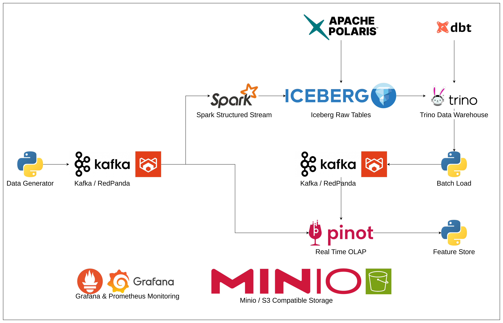

# Realtime Data Platform K8s Demo

This project contains an investigation and demonstration of an alternative architecture for real-time online feature
serving by replacing per-feature stateful streaming pipelines with a single unified modern OLAP serving layer. 
This project seeks to propose that this architecture can make request-time feature computation viable at low latencies.

This project can be deployed in any K8s environment and makes use of purely free open source software.

## Pre-requisites

Please install the following before attempting to run anything in this project:
* MiniKube (or another k8s environment)
* Kube Tools - `kubectl`
* Helm
* UV
* Docker
* K9s (recommended)

### Hardware
I'm running a Lenovo ThinkPad with an Intel Ultra 7 14-core CPU & 32GB of memory.
To run _everything_ at once, I would recommend a similar number of cores and memory.

## How to run
1. Start Kubernetes - with MiniKube:
```
minikube start --cpus=10 --memory=18g
```
2. Build images and apply kube config:
```
make apply
```

You can then fire up K9s and watch the various pods come up.

Please note that this may take a while depending on your internet connection whilst images are pulled. 
Depending on race conditions with CRDs in helm you may need to run `make apply` twice. 
All services should be resilient to restart, so if a component fails (e.g. `sparkapplication`), then 
delete it with `kubectl delete` and re-apply.

## Architecture


This architecture leverages Apache Pinot to enable high throughput, low latency querying
and aggregating of feature data to be served through the feature store service.

To source data, Kafka (RedPanda) is used to transport data from producers to both Pinot and a Spark Structured 
Stream that writes to Iceberg tables.

For batch processing we use dbt with Trino to enable high performance analytics queries.
These queries produce batch feature tables which are then loaded into Pinot via Kafka.

For storage we use MinIO with S3 compatible APIs.
For monitoring we use Prometheus with Grafana.

### Request-time feature computation with Apache Pinot
Traditional online feature serving relies on continuously pre-computed features leveraging stateful streaming pipelines
(such as Apache Flink) pushing data to low latency key-value stores (such as Redis).

Whilst this architecture can deliver extremely low read and end to end latency, it introduces a stateful streaming
pipeline for each feature set. 
Feature computation, state management, infrastructure deployment, backfills, schema evolution and pipeline versioning
all become tightly coupled to long-running streaming jobs.
This adds a significant amount of engineering overhead each time a new set of features are required, and more importantly
the added complexity sits directly on the critical path from data production to customer affecting decisions.

Such pipelines often take the following form:
```
kafka -> flink -> redis -> feature store API -> ML inference
```

#### Enter Pinot...
This project explores an alternative approach:
```
kafka -> pinot -> request time sql -> feature store API -> ML inference
```

Rather than materialising every possibly required feature value, features can be expressed as static SQL and can be computed
at request time as and when needed.

#### Motivation
Many online feature stores deployed in highly active ML and Data Science organisations have two competing sets of requirements:
* **Low latency** - many online ML use cases have strict latency SLAs for feature retrieval, beyond which the value of making a decision significantly depreciates.
* **Feature flexibility** - Engineers and data scientists need to be able to change, add and experiment with new features at pace without repeatedly deploying and operating bespoke streaming infrastructure.

The stateful streaming approach mentioned above heavily optimises for the first requirement.
This can work very well when the feature requirements are well known and rarely change.
However, the operational cost can grow significantly as feature requirements change and grow.

Each new set of features needs consideration of:
* new streaming computations
* state management & checkpointing
* infrastructure deployment and monitoring
* schema management
* backfills
* migration and pipeline versioning
* operational ownership and monitoring

Long-lived stateful pipelines also introduce lifecycle concerns.
Changes to stateful streaming logic or to upstream data can require complex coordinated migrations between multiple running
versions of a feature pipeline.

An additional less obvious problem is high-dimensional entity keys. Suppose we have the following keys for a financial transaction:
```
(user_id, account_id, card_id, counterparty_id, ...)
```

Pre-computing every possible combination can yield enormous amounts of state due to the combinatorial explosiveness of
adding new high cardinality entity keys. The vast majority of this state may sit unqueried resulting in wasted storage space and
compute resources.

By computing features at request-time we can side step this issue by computing only exactly what we need.
By using a single OLAP querying layer we can also amortise our infrastructure costs and make feature development
as simple as configuration and SQL (ubiquitous among data folk).

#### The Pinot Hypothesis
> For some (_near_) real-time ML feature serving workloads, a highly optimised, OLAP engine can achieve sufficiently 
> low latency such that request time computation is preferable to maintaining a large collection of feature
> specific streaming pipelines.

In other words, in some scenarios, it's preferable to trade some latency and compute efficiency for greater flexibility
and operational simplicity.

#### The Pinot feature development lifecycle
The traditional feature development lifecycle looks like this:
1. Write a feature streaming job
2. Deploy the job along with streaming infrastructure (Flink)
3. Trigger backfill process
4. Create/wait for consistent state to build up
5. Validate correctness
6. Migrate feature serving to newly created Redis tables

Under this proposed architecture:
1. Define new SQL
2. Deploy as configuration as a new feature version
3. Validate correctness
4. Migrate model to new feature endpoint

In the Pinot approach, infrastructure is not a concern. 
Data scientists and ML engineers don't need to concern themselves with VCPUs, memory, instance types, networking, IAM, etc.
Instead this is managed centrally by ML platform engineers.

### Performance

In order to test performance I ran the platform locally with varying rates of event production.
I instrumented the data generator service to monitor event production to ensure that the configured event rate was met.
I've then taken screenshots of the key metrics collected across the feature store, pinot and the freshness probe to demonstrate
the achievable latencies of this architecture on my constrained hardware.

The follow event production rates were tested:
* 4 events/second
* 10 events/second
* 50 events/second

##### Methodology
The following numbers are queried from prometheus over a 10-minute period.
After changing the rate in the `data-generator` I waited for the metrics to settle - as this is running a lot of services
in a heavily constrained environment with no autoscaling, changes to services can lead to very jittery metrics.

The following query was used:
```
scaling * 
histogram_quantile(
  0.99|0.9|0.5,
  sum(
    increase(relevant_metric_name[10m])
  ) by (le)
)
```

#### Feature store response times
This measures the time response time of the feature store API.

| rate | p50 response times (ms) | p90 response times (ms) | p99 response times (ms) |
|------|-------------------------|-------------------------|-------------------------|
| 4    | 18                      | 29                      | 50                      |
| 10   | 17                      | 24                      | 47                      |
| 50   | 19                      | 36                      | 66                      |

#### Pinot query times
This measures the time that Pinot takes to process a query and generate feature data.

| rate | p50 query times (ms) | p90 query times (ms) | p99 query times (ms) |
|------|----------------------|----------------------|----------------------|
| 4    | 13                   | 23                   | 42                   |
| 10   | 12                   | 20                   | 32                   |
| 50   | 14                   | 24                   | 57                   |

#### Freshness probe end to end latency times
This measures the upper bound time it takes from an event being created to it being successfully queried in the feature store
via the feature store API.

*Note: this is an upper bound as we poll the feature store for the record, the actual freshness may be lower than this.

| rate | p50 latency (ms) | p90 latency (ms) | p99 latency (ms) |
|------|------------------|------------------|------------------|
| 4    | 31               | 57               | 110              |
| 10   | 27               | 46               | 60               |
| 50   | 35               | 62               | 270              |

Screenshots of the full metrics can be viewed [here](./DASHBOARDS.md).

### Trade-offs and drawbacks
As is with any architecture, this approach is not perfect and does involve a number of trade-offs.
This approach seeks to improve flexibility and total cost of ownership, but this is a trade-off with raw performance and latency
meaning this solution may not work for some use cases.

#### Online/offline skew
This is probably the single biggest drawback of this architecture.
When a stateful stream outputs features to a Kafka topic which then get written to Redis, it is trivial to add another
consumer that archives those features in lake/warehouse storage.
This then serves as your training and validation datasets; you can be certain that these datasets were produced using
the exact system that is used at inference time.
In theory this should eliminate any chance of [leakage](https://en.wikipedia.org/wiki/Leakage_(machine_learning)) or variability
in the two datasets (offline store & online store) reducing differences between ML model performance at inference time vs 
validation time.

With Pinot, such an architecture is not possible as we do not calculate all possible feature values, we calculate only
those that are required for feature serving.
Therefore, we must use some other offline system to produce training and validation datasets.
Without careful governance it is possible that training/validation and inference datasets could diverge hurting ML model 
performance.

#### Latency
Relative to a traditional Flink and Redis style architecture, this approach sacrifices feature retrieval latency.
While Pinot can ingest from Kafka at very low latency, moving feature computation from ingestion to request time means
that serving latency is inherently higher that a simple pre-computed key-value look up.
The benefit here is that with Flink that feature logic is much harder to change and must be applied to every possible
entity key combination, whereas with Pinot, a change to the feature logic is a simple configuration change.
Where we can afford additional 10s of milliseconds in our latency budget, flexibility may be preferable.

Importantly, moving where the computation happens does not mean sacrificing data freshness, both architectures
depend on the time taken for new events to be become available to the serving layer. The difference is simply where
the feature computation happens.

#### Compute shifts from ingestion to serving
In some scenarios this can be preferable, especially if the majority of feature records are consumed once, or not at all. 
However, if the same feature record is retrieved from the feature store multiple times without any changes to the
underlying data, then that feature record must be re-calculated wasting compute resources.

This is particularly wasteful for low dimensional entity key features or global features that are only updated infrequently,
e.g. `account_age_days` - this value changes once in 24 hours but could need to be recalculated multiple times for a given
account.

Put simply, precomputation amortises computation across all future consumers; request time computation amortises computation
across only the requests that actually occur. 
The relative efficiency of this architecture therefore depends on the relationship between the data change rate, the 
feature request rate and feature complexity.

#### A centralised database is added to the inference critical path
Redis and Flink are tried and tested pieces of infrastructure that are often architecturally and physically
segregated and may be scaled independently.
This architecture introduces Pinot as a single compute and serving layer for all features across an organisation.
This creates a shared critical dependency with a potentially large failure blast radius.
Degradation of Pinot can and may impact all real-time ML models consuming features from your feature store.

To help mitigate this you can configure multi-tenancy, specify various hardware requirements for specific Pinot use cases,
and implement high availability, but a single human error can bring down your entire online ML serving estate.

#### Scaling sensitivity
Pinot's resource consumption can vary widely with query shape, complexity and data volume, whereas as simple
Redis `GET` has comparatively predictable resource consumption requirements.
Furthermore, as experienced with this architecture, Pinot can take several minutes on start up to become fully available.
Therefore, simply scaling reactively due to a spike in memory or CPU usage may not be sufficient.
Time-based predictive scaling may be required, more so than it might be for Redis or Flink.

## Develop

### Maintaining the repo

* [Updating helm charts](./helm/README.md)
* [Applying to kubernetes](./kube/README.md)
* [Building images](./images/README.md)
